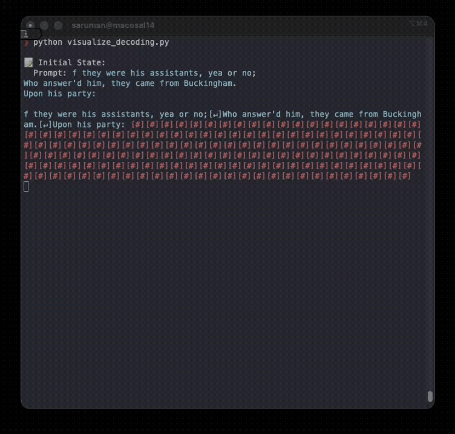
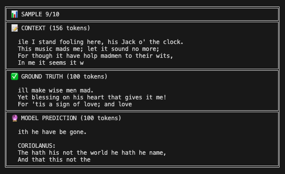

# CharDLM

Simple character-level diffusion language model implemented in JAX.

Block decoding using NVIDIA's [Fast-dLLM](https://arxiv.org/pdf/2505.22618) algorithm (Wu et al., 2025).

## Demo

This is what Fast-dLLM decoding with block size of 4 looks like. Here I used a 10.8M parameter CharDLM model trained with 256 characters context length.



Sample evaluation:



## Pre-training

The demo model is basically the `chardlm-big` implementation detailed in `chardlm/model.py`. 

### Model Specifications 

- Context length: 256 characters
- Embedding dimension: 384
- Number of heads: 6
- Number of layers: 6
- Dropout rate: 0.2
- Total parameters: ~10.8M (~44 MB on disk)
- Diffusion steps: 100
- Noise schedule: Linear

Training was done on a single A100 GPU over 20k steps and it took me about 30 minutes overall.

The model did not fully converge when training was finish, so there is still a lot of room for improvement but I would like to save my wallet for other papers for now.

## Setup

### Dataset

The Tiny Shakespeare dataset is packaged with the repo, but if you want to donwload it yourself:

```bash
mkdir -p dataset
curl -o dataset/tiny_shakespeare.txt https://raw.githubusercontent.com/karpathy/char-rnn/master/data/tinyshakespeare/input.txt
```

### Installation

```bash
pip install -e .
```

## Usage

### Training

```bash
python train.py
```

### Generation

```bash
python generate.py
```

## Post-amble

This project was inspired by the announcement of Google DeepMind's [Gemini Diffusion](https://deepmind.google/models/gemini-diffusion/) and was built on top of the Andrej Karpathy's NanoGPT (not nanochat GPT!). This means the LLM is a bit dated, for example, using absolute positional embeddings rather than RoPE. This choice was intentional and the beauty for me is in its simplicity; and if anything, this project proves that you *can* build a functional diffusion language model using absolute positional embeddings. 

I was also heavily inspired by Nathan Barry's [tiny-diffusion](https://github.com/nathan-barry/tiny-diffusion) project which was built on top of nanochat GPT.